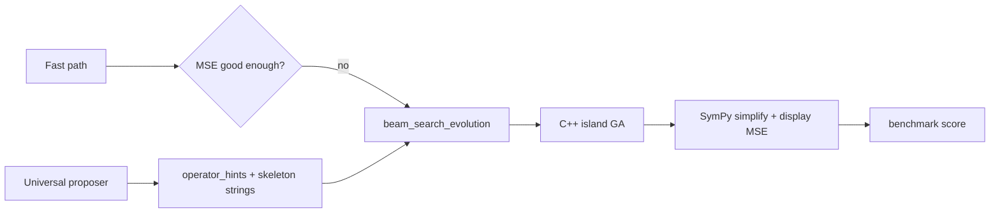

Your benchmark is strong overall (70% exact, 143/205), but the failures line up with how evolution searches—not with the proposer’s difficulty/budget logic.

## What the benchmark is telling you

| Tier | Exact % | Main pain |
|------|---------|-----------|
| 1–5 | 88–100% | A few hard sums (`x³+sin(x)`, `x²+log(x+1)`) |
| 6–7 | 36–52% | Rational/nested forms, products, damped oscillations |
| 8 | 12% | Nested trig, `log×sin`, products with `exp` |

Hard cases share a pattern: **low raw MSE, wrong structure** — e.g. `x**2.33`, sums of `sin(kx)` instead of `x²·sin(x)`, or `0` / near-zero fits (`x³/(1+x⁴)` → `0`).

There is also **run-to-run inconsistency** on the same target:

- `x^6+x^5+…+x`: **FAIL** in Tier 2 (126s, wrong coeffs), **PASS** in Tier 4 Nguyen (1.1s)
- Same expression, different `x_range` (-2,2) vs (-1,1) and different random search paths

So you are not missing a single “hard formula class” — you are hitting **stochastic local optima** and **representation/search bias**.

---

## How evolution actually works (and where it breaks)



**Representation:** Each individual is a graph whose prediction is a **weighted sum of node outputs** (products/ratios exist via multiply/divide nodes, but the default search bias is additive).

**Search:** Island GA with Lamarckian + macro mutations (wrap, multiply, divide, nest), ridge/LM on constants, complexity penalty, optional early stop at `mse < 1e-6`.

**Beam search:** Proposer only adjusts **beam configs** (`op_priors`, `seed_omegas`, pop/gens). The C++ call does **not** pass `seed_graphs_py`:

```2908:2922:d:\Glassbox\scripts\classifier_fast_path.py
        result = _core.run_evolution(
            X_list=X_list,
            y=y_np,
            pop_size=total_pop_size,
            generations=total_generations,
            ...
            multi_op_priors=multi_op_priors,
            multi_seed_omegas=multi_seed_omegas,
            num_threads=max_physical_threads,
        )
```

C++ supports seeding up to 25% of the population from graphs, but nothing in Python builds/passes them:

```886:891:d:\Glassbox\glassbox\sr\cpp\evolution.h
        int max_seed = std::min((int)seed_graphs_.size(), config_.pop_size / 4);
        for (int i = 0; i < max_seed; ++i) {
            population_[i] = seed_graphs_[i];
```

So the proposer’s **skeleton formulas never become starting individuals** — only operator hints and budget. That explains “proposer looks right, evolution still wanders.”

**High-confidence proposer shrinks exploration:**

```3046:3052:d:\Glassbox\scripts\classifier_fast_path.py
    if confidence > 0.8 and candidate_formulas:
        n_beams = min(n_beams, len(candidate_formulas) + 2)
        n_rounds = 1
```

Fewer beams + one round → more variance and more “lucky/unlucky” tier-to-tier swings.

**Continuous powers:** `Power` allows non-integer `p` (e.g. `x**2.33`). Fitness can be excellent while the formula is not algebraically exact — classic SR “numerical twin” problem (PySR’s **simplify** step exists partly for this).

**Scoring uses display MSE only** (`_select_score_mse`), after SymPy snap — so engine “wins” can still score FAIL if simplification doesn’t recover the true form.

---

## Failure archetypes (from your report)

1. **Product vs sum** — `x^2*sin(x)`, `x^3+sin(x)`: evolution prefers `a·sin(x)+b·sin(2x)+…` or `x + 0.84·x³` (missing `sin`).
2. **Rational collapse** — `x^3/(1+x^4)` → `0` (wrong topology, constants zeroed).
3. **Fractional-power surrogates** — `log(2x+1)`, `x/(1+abs(x))`, many Tier 7–8 APPROX rows.
4. **Identity near-miss** — `sin(pi*x)` → `sin(3.14*x)` (constant snapping, not search).
5. **Good fit, wrong score** — many APPROX have `MSE(raw) ~ 1e-6` but `MSE(display) ~ 1e-3` (structure/simplify gap).

---

## Simple, out-of-the-box improvements (no heavy math)

Ordered by impact vs effort:

### 1. Actually seed evolution from proposer + fast-path (high impact, medium effort)

Wire `candidate_formulas` → parse to `IndividualGraph` → `seed_graphs_py` in `_core.run_evolution`. Seed **fast-path best** + top-3 proposer skeletons (e.g. `x**2+sin(x)`, `x*sin(x)`).  
This is the biggest gap between what you built and what runs.

### 2. Residual peeling (high impact, simple)

PySR/GSR-style **staged fit**, without new theory:

1. Fit dominant term (polynomial degree from `np.polyfit`, or single `sin(ωx)` from FFT).
2. Subtract fit from `y`, evolve on residual with smaller graph budget.
3. Add terms and run SymPy `expand`/`simplify` on the sum.

Fixes many Tier 5–7 sum/product failures (`x³+sin(x)`, `exp(-x)*sin(x)`) with ~50 lines.

### 3. Post-search “exactness pass” (medium impact, simple)

After evolution, if `raw_mse < 1e-4` but display fails:

- Snap floats (`snap_formula_floats` — you already have this).
- Try **integer power** replacement: round all `x**p` to nearest int in `{1..8}` and re-fit coeffs with linear least squares.
- Try **trig product identities** on the candidate (e.g. if many `sin(kx)` terms, test `sin(a)*cos(b)` forms).

Cheap compared to more generations.

### 4. Don’t reduce beams when “confident” (low effort)

High proposer confidence currently **cuts** diversity. Invert: confident → **more** refinement beams on skeleton seeds; uncertain → full 10-beam exploratory suite.

### 5. Polynomial fast lane (low effort)

You already detect `polynomial_mode` in beam search. For `poly_degree` from `polyfit`, add a beam that is **pure IntPow basis** `x, x², …, xⁿ` with only coefficient mutation (no structural mutation). Would fix Tier 2 #4-style misses reliably.

### 6. Product-aware macro mutation bias (low effort)

When hints include both `power` and `sin`, boost **multiply macro_mutate** rate (currently 15% macro vs Lamarckian). Helps `x²·sin(x)` without new operators.

### 7. Fixed random seed per benchmark formula (low effort)

Same formula + range → same seed → reproducible benchmarks and easier A/B on changes.

### 8. Proposer grammar depth (medium effort)

`_build_univariate_grammar_candidates(max_depth=2)` has no `x**2*sin(x)`, `x**3/(1+x**4)`, etc. Extend grammar with a few **benchmark-driven templates** (products, one rational). Training can stay the same; decoding gets better seeds.

### 9. Island specialization (you almost have this)

Islands already differ by `op_priors`. Add one **“rational island”** (`Division`-heavy) and one **“product island”** (`multiply` macro only) — inspired by PySR multi-population, but minimal.

### 10. Benchmark scoring tweak (optional)

For research comparisons, log both **structural exact** (SymPy `simplify(target - discovered) == 0`) and **numeric exact** (MSE). Many APPROX rows are “human exact” after one identity step.

---

## Ideas from other systems (kept simple)

| System | Idea | Glassbox fit |
|--------|------|----------------|
| **PySR** | evolve → **simplify** → re-optimize constants | Post-pass #3 + stronger SymPy on winner |
| **PySR** | **Multiple populations** / islands | You have islands; add rational/product flavors |
| **Eureqa / gplearn** | **Building blocks** from partial solutions | Residual peeling #2 |
| **AI Feynman / PySR** | **Neural hint** for structure | Proposer — but must **seed graphs**, not only priors |
| **Operon** | Separate **coefficient** tuning | You already do ridge/LM; use more on fixed skeletons |

No need for full neural-SR or MCTS unless you want a later phase.

---

## Why scores got “better overall” but worse on some formulas

- **More budget** (500–3000 gens from difficulty) helps hard Tier 6–8 APPROX but increases time (~120s per hard case) and can still land in **different local minima**.
- **Confident proposer** reduces beam diversity → regressions on formulas that need exploration (e.g. rational forms).
- **Fast-path skip** when MSE is tiny: good for speed, but can skip evolution that would **simplify** to exact form.
- **Stochastic GA** without fixed seeds → pass/fail flip on identical targets (Tier 2 vs 4 `x^6+…+x`).

---
# Future Optimization Notes

## Current Status (2026-06-03)

This note captures optimization ideas from earlier benchmark observations. Some
items are now implemented or partially implemented: proposer/fast-path seed
graphs feed C++ evolution, residual symbolic stages exist behind flags,
displayed-formula scoring is the benchmark contract, polynomial/exact-match
fast lanes exist, and C++ island specialization is the guided-evolution default.
Use `docs/PROJECT_MAP.md` for current architecture and this file for historical
idea context.
